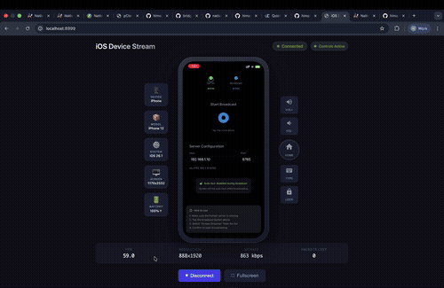

# iOS Screen Streaming & Remote Control

Stream and control your iOS device in real-time from any web browser. This project enables low-latency screen mirroring via WebRTC with full touch/gesture control through WebDriverAgent.

## 🎬 Demo



**[▶️ Watch Full Demo Video (1:20)](docs/demo.mov)**

### Features Demonstrated:
- ✅ Real-time screen streaming from iOS to web browser
- ✅ Low-latency WebRTC video delivery with hardware H264 encoding
- ✅ Device control via WebDriverAgent (tap, swipe, volume, home button)
- ✅ Device information display (model, system version, battery, screen resolution)
- ✅ Auto-lock prevention during broadcast
- ✅ Multi-viewer support with synchronized playback

---

## Features

### Streaming
- **Low Latency**: Target <150ms end-to-end latency
- **Hardware Encoding**: H264 encoding via VideoToolbox
- **WebRTC Distribution**: Stream to any modern browser
- **Multi-Viewer Support**: Multiple concurrent viewers
- **Native Resolution**: Automatic detection of device screen dimensions

### Remote Control (via WebDriverAgent)
- **Touch & Tap**: Single tap, double tap, long press
- **Swipe Gestures**: Swipe in any direction
- **Scroll**: Mouse wheel scrolling support
- **Hardware Buttons**: Home, Volume Up, Volume Down
- **Text Input**: Type text directly from your keyboard
- **Real-time Response**: Commands execute instantly on device

## Architecture

```
┌─────────────────┐     WebSocket      ┌─────────────────┐     WebRTC      ┌─────────────────┐
│   iOS Device    │ ──────────────────▶│  Python Server  │◀──────────────▶│     Browser     │
│   (ReplayKit)   │   H264 Frames      │                 │   Video Stream │    (Viewer)     │
└─────────────────┘                    │                 │                └─────────────────┘
                                       │                 │                        │
┌─────────────────┐     HTTP REST      │                 │     WebSocket          │
│ WebDriverAgent  │◀───────────────────│                 │◀─────────────────────────
│   (on device)   │   Touch Commands   └─────────────────┘   Control Commands
└─────────────────┘
```

## Quick Start

### Prerequisites

- macOS 12.0+ with Xcode 15.0+
- Python 3.10+
- Real iOS device (iOS 15.0+)
- Apple Developer Account (free Apple ID works)
- Node.js 18+ (for Appium/WDA)

### Option 1: Stream Only (No Control)

If you just want to stream without remote control:

```bash
# 1. Install dependencies
./scripts/install-deps.sh

# 2. Start server (no control)
./scripts/start-server.sh --no-control

# 3. Build and run iOS app in Xcode
open ios-app/BroadcastApp/BroadcastApp.xcodeproj

# 4. Start broadcast from iOS and view at http://localhost:8999
```

### Option 2: Stream + Remote Control (Full Setup)

For full streaming and control capabilities:

#### Step 1: Install Dependencies

```bash
# Python dependencies
./scripts/install-deps.sh

# For port forwarding (if using USB)
brew install libimobiledevice
```

#### Step 2: Set Up WebDriverAgent

WDA must be running on your iOS device to enable remote control.

**Clone and build WebDriverAgent:**

```bash
# Clone the repository
git clone https://github.com/appium/WebDriverAgent.git
cd WebDriverAgent

# Open in Xcode
open WebDriverAgent.xcodeproj
```

**Configure in Xcode:**

1. Select the **WebDriverAgentRunner** target
2. Go to **Signing & Capabilities**
3. Check "Automatically manage signing"
4. Select your Team (Apple ID)
5. If bundle ID conflicts, change to unique ID (e.g., `com.yourname.WebDriverAgentRunner`)
6. Do the same for **WebDriverAgentLib** target

**Run WDA on your device:**

1. Connect your iOS device via USB
2. Select your device in Xcode toolbar
3. Press `Cmd+U` to run tests (this installs and starts WDA)
4. Trust the developer certificate on iOS if prompted (Settings → General → VPN & Device Management)

**Set up connection to WDA:**

You have two options:

**Option A: USB Connection (using iproxy)**
```bash
# Forward WDA port from device to Mac
iproxy 8100 8100
```
Keep this terminal open. Then start the server normally:
```bash
./scripts/start-server.sh
```

**Option B: WiFi Connection (no USB needed)** 🎉
```bash
# Find your device's IP address:
# Settings → Wi-Fi → (i) icon → IP Address
# Example: 192.168.1.100

# Start server with device IP
./scripts/start-server.sh --wda-host 192.168.1.100
```

For more details on wireless setup, see [docs/WIRELESS_WDA.md](docs/WIRELESS_WDA.md)

#### Step 3: Verify WDA is Running

```bash
curl http://localhost:8100/status
# Should return {"value":{"ready":true,...}}
```

#### Step 4: Start the Streaming Server

```bash
./scripts/start-server.sh
```

Or with debug logging:
```bash
./scripts/start-server.sh --debug
```

#### Step 5: Build and Run iOS App

1. Open in Xcode:
   ```bash
   open ios-app/BroadcastApp/BroadcastApp.xcodeproj
   ```

2. Configure signing for both targets (BroadcastApp and BroadcastExtension)

3. Update server address in `Shared/Constants.swift`:
   ```swift
   static let host = "YOUR_MAC_IP"  // e.g., "192.168.1.100"
   ```

4. Build and run on your device (Cmd+R)

#### Step 6: Start Broadcasting

1. Open the app on your iOS device
2. Tap the broadcast button
3. Select "BroadcastExtension"
4. Tap "Start Broadcast"

#### Step 7: View and Control

Open http://localhost:8999 (or http://YOUR_MAC_IP:8999 from other devices)

**Controls available in the web viewer:**
- **Click/Tap on video**: Tap on device
- **Click and drag**: Swipe gesture
- **Long click**: Long press
- **Double click**: Double tap
- **Mouse wheel**: Scroll
- **Vol+/Vol- buttons**: Adjust volume
- **Home button**: Go to home screen
- **Type button**: Enter text to type

---

## Web Viewer Controls

| Action | How to Perform |
|--------|----------------|
| Tap | Click on the video |
| Double Tap | Double-click on the video |
| Long Press | Click and hold for 500ms |
| Swipe | Click and drag |
| Scroll | Mouse wheel |
| Home Button | Click the Home button |
| Volume Up/Down | Click Vol+/Vol- buttons |
| Type Text | Click Type button, enter text |

---

## Server Options

```bash
# Start with full control (default)
./scripts/start-server.sh

# Start without device control
./scripts/start-server.sh --no-control

# Test mode (no iOS device needed)
./scripts/start-server.sh --test

# Custom port
./scripts/start-server.sh --port 9000

# Debug logging
./scripts/start-server.sh --debug

# Stream a video file instead
./scripts/start-server.sh --media video.mp4
```

---

## Configuration

### Server Configuration

Edit `server/config.py`:

```python
# Network
WEBSOCKET_HOST = "0.0.0.0"  # iOS connects here
WEBSOCKET_PORT = 8765
HTTP_PORT = 8999            # Browser connects here

# WebDriverAgent (for device control)
WDA_HOST = "localhost"      # WDA host (localhost with iproxy)
WDA_PORT = 8100             # WDA port
```

### iOS App Configuration

Edit `ios-app/BroadcastApp/Shared/Constants.swift`:

```swift
enum Server {
    static let host = "192.168.1.100"  // Your Mac's IP
    static let port = 8765
}

static let appGroupIdentifier = "group.com.yourname.broadcast"
```

---

## Project Structure

```
nativebridge-ios-web-streamer/
├── ios-app/                    # iOS application
│   └── BroadcastApp/
│       ├── BroadcastApp/       # Main app (UI)
│       ├── BroadcastExtension/ # Broadcast extension
│       └── Shared/             # Shared code
├── server/                     # Python streaming server
│   ├── main.py                 # Entry point
│   ├── ios_receiver.py         # WebSocket receiver for video
│   ├── webrtc_server.py        # WebRTC server
│   ├── video_track.py          # Video track handling
│   ├── control_server.py       # Device control via WDA
│   ├── wda_client.py           # WebDriverAgent client
│   ├── frame_queue.py          # Frame buffering
│   └── config.py               # Configuration
├── web/                        # Web viewer
│   ├── index.html              # Viewer UI
│   ├── viewer.js               # WebRTC client + controls
│   └── style.css               # Styling
├── scripts/                    # Utility scripts
│   ├── start-server.sh         # Start server
│   ├── build-ios.sh            # Build iOS app
│   └── install-deps.sh         # Install dependencies
├── docs/                       # Documentation
│   ├── wda-setup.md            # WDA setup guide
│   ├── quick-start.md          # Quick start guide
│   └── troubleshooting.md      # Troubleshooting
└── test_appium.py              # Appium/WDA test script
```

---

## Network Ports

| Port | Protocol | Purpose |
|------|----------|---------|
| 8765 | WebSocket | iOS → Server (video frames) |
| 8999 | HTTP/WS | Web UI, signaling, control |
| 8100 | HTTP | WebDriverAgent (device control) |
| 10000-10100 | UDP | WebRTC media |

---

## Troubleshooting

### Device Control Not Working

1. **Check WDA is running:**
   ```bash
   curl http://localhost:8100/status
   ```

2. **Check control status in browser:**
   - Look at the "Controls" indicator in the header
   - Green = WDA connected and working
   - Yellow = Server connected but WDA not available
   - Red = Not connected

3. **Verify WDA session:**
   ```bash
   curl http://localhost:8999/control/status
   ```

### Home Button Not Working

The home button uses WebDriverAgent's `pressButton` API. Supported buttons:
- `home` - Works
- `volumeUp` - Works
- `volumeDown` - Works
- `lock` - Not supported by WDA

### Stream Not Appearing

1. **Check iOS broadcast is active** (red status bar on device)
2. **Check server logs** for "iOS client connected"
3. **Verify network connectivity** between iOS device and Mac
4. **Try test mode** to verify server works: `./scripts/start-server.sh --test`

### WDA Connection Issues

1. **Restart WDA session:**
   - Stop current Appium session
   - Run `python3 test_appium.py` again

2. **Check USB connection:**
   - Ensure device is connected via USB
   - Trust the computer on iOS device

3. **Port forwarding:**
   ```bash
   # If using manual WDA, ensure port forwarding is running
   iproxy 8100 8100
   ```

### High Latency

1. Use wired connection instead of Wi-Fi
2. Reduce video quality in iOS app settings
3. Check for network congestion

---

## Requirements

### macOS
- macOS 12.0+
- Xcode 15.0+
- Python 3.10+
- Node.js 18+ (for Appium)

### iOS
- iOS 15.0+ (real device required for broadcast)
- Device must be unlocked and trusted

### For Device Control
- WebDriverAgent running on iOS device
- Appium (recommended) or manual WDA setup

### Browsers
- Chrome, Safari, Firefox, Edge (modern versions with WebRTC support)

---

## Important Notes

1. **ReplayKit broadcast extensions do NOT work in the iOS Simulator.** You must use a real iOS device.

2. **WebDriverAgent requires a developer certificate.** Use Appium to automatically handle signing and installation.

3. **First-time WDA installation may take 2-5 minutes** as it builds from source.

4. **Trust the developer certificate on iOS** if prompted (Settings → General → VPN & Device Management).

---

## License

MIT
